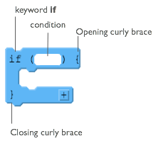
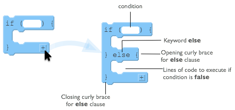
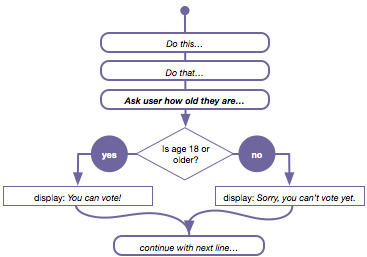

# Boolean Expressions & If Statements

## Overview

In this lesson you learn how to write and use if statements in JavaScript by debugging common problems, solving simple problems, or adding conditional logic into an existing app or game.

## Vocab

`Boolean` - A single value of either TRUE or FALSE

`Boolean Expression` - in programming, an expression that evaluates to True or False.

`Conditionals` - Statements that only run when certain conditions are true.

`If-Statement` - The common programming structure that implements "conditional statements".

`Selection` - A generic term for a type of programming statement (usually an if-statement) that uses a Boolean condition to determine, or select, whether or not to run a certain block of statements.

## New Code

```
if( ){
  //code
}

if ( ){
  // if code
} else {
  // else code
}

__ == __
__ != __
__ > __
__ >= __
__ < __
__ <= __

```

// one
// let x = 0,
// y = 10,
// z = -5;
// let word1 = "puppy",
// word2 = "kitten",
// word3 = "PUPPY";

// let bool1 = x < y;
// console.log(bool1); //true
// // two
// let bool2 = word1 == word3;
// console.log(bool2); //false

// // three
// let bool3 = y != x;
// console.log(bool3); // true
// // four
// let bool4 = 10 >= z;
// console.log(bool4); //true
// // five
// let bool5 = word1 === x;
// console.log(bool5); //false
// // six
// let bool6 = z > y;
// console.log(bool6); //false

## Introduction to Conditionals: Boolean Expressions

Watch the video: https://youtu.be/y3rCKJNOwpA

## Boolean Expressions and Comparison Operators

#### Boolean, Boolean values, Boolean expressions:

A `Boolean value` is simply a computer science-y term that means a true/false value.

A `Boolean expression` is a statement that evaluates to a Boolean value (a single true/false).

#### Condition, Conditionals, Conditional Statements:

`Conditional` is simply a generic term for code that alters program flow based on true/false values (like an if statement)

#### Comparison Operators:


A common type of condition to check is a comparison of two values. Here are 6 common comparison operators. Each compares a value on the left with a value on the right and returns a Boolean value true or false. Most of these do what you would expect.

#### == is equal to

- We use == because the single equal sign = is the assignment operator. We need something different to indicate we want to compare two values instead of assign one to the other.

```
age = 18  vs age == 18 are VERY VERY different

**Common mistake**: Writing something like if (age = 18) instead of if (age == 18). We'll make sure we get this down later.
```

- "Hello" == "hello" returns false -- because the strings are slightly different.
- "3" == 3 returns true -- == tries to be forgiving. If it can "coerce" a string into a number it will do so to compare. 1
- (2+1) == 3 returns true -- because the arithmetic expression evaluates to 3.
- "(2+1)" == 3 returns false. "(2+1)" is not arithmetic, it is a string.
- x == 7 returns true -- when the variable x has the value 7.

#### != is not equal to

- Compares two values - numbers, strings, or other booleans - and returns true if they are not equal, otherwise false.

  - "Hello" != "hello" returns true -- because the strings are slightly different.
  - "3" != 3 returns false -- because the string 3 can be coerced into a number before comparing with 3. (see notes above about the forgiving ==).
  - (2+1) != 3 returns false -- because the arithmetic expression evaluates to 3.
  - x != 7 returns true -- when the variable x is any value other than 7.

> Example: Write 4 boolean expressions using the variables: x = 10, y = 0, z = "pop", w = "POP"
>
> Example: A student says that x = 10 is a boolean expression that results in True. Why is this student incorrect?

## Introduction to Conditionals: if Statements

Watch video: https://youtu.be/0oG3Wck2fRU

#### Understanding Program Flow

Programs are said to have a "flow of execution". You start by executing some line of code and then the next and so on.

A flow chart is a common visual that's used to represent the various paths of execution that your program might take. Many people use them to help plan.


1. This flow chart depicts a program executing one line after another until it gets to a point where it needs to make a decision.

2. In order to determine which path to take you state some condition. It should be a Boolean expression - something that evaluates to true or false. Here we have a simple comparsion of two values: the person's age and the number 18.

3. The program does one thing if the condition is true, and something else if the condition is false.

4. The program can continue a single thread of execution after the condition as well.

### How If-statements work

if statements are the lines of code you need to change the flow of execution while you're program is running. You can write code that makes a decision that determines which lines of code should be run next.



There are two basic parts to an if-statement.

1. A condition to be evaluated (A Boolean expression that evaluates to true or false)
2. Code that should run if the expression was true - enclosed in curly braces

### A Worked Example


1. Program executes line by line as you would expect. It displays a message, then prompts the user to enter a number. Whatever the user types will be stored in the variable age and then proceeds to the next line...

2. When the if statement is encountered the first thing it does is evaluate the condition in the parentheses. It checks to see if, at this point in the program, the value in a variable age is greater than or equal to 18. If it is then we say the expression "returns true". Otherwise it returns false.

3. These console.log statements will only execute if the expression was true. The curly braces surround all of the code that should be executed if, and only if, the expression was true. Otherwise, the entire section of code encapsulated in the if statement is skipped.

4. Execution picks up here, on the first line after the closing curly brace of the if-statement. This line will always execute, but notice that if the user entered an age less than 18, the entire if statement would be skipped, and it would just say "Thanks for verifying". (We'll fix this awkwardness soon).

> Example. Create a Surfs Up application that prompts the user for the wave height and then displays "Great day for surfing!" if the waves 6 feet and over.

<!-- let waveheight = +prompt("How high are the waves?");

if (waveheight >= 6) {
  console.log("Great day for surfing");
}
console.log("Have a nice day"); -->

> Example. Create an application that asks the user for a comic character and displays either MARVEL or DC COMICS:

<!-- > var hero = prompt("Enter a suoerhero");
if (hero == "Batman") {
  console.log("DC Comics ");
}
if (hero == "wonder women") {
  console.log("DC Comics");
}
if (hero == "captain america") {
  console.log("marvel");
}
if (hero == "spiderman") {
  console.log("marvel");
} -->

> > > Batman, Wonder Woman : DC Comics
> > >
> > > Captain America, Spiderman : Marvel

## Introduction to Conditionals: if-else Statements

Watch video: https://youtu.be/ZIL_3YRD14s

How If-Else Statements work





With an if-else statement you are giving an either-or command:

- either the lines of code inside the if will execute; or
- the lines inside the else will execute.

Inside the curly braces for the else clause you put lines of code that you want to run if the Boolean condition from the if statement is false. Some important notes about the else clause:

- The else must come immediately after the closing curly brace of an if statement
- The else also has its own set of opening and closing curly braces to encapsulate lines of code

Considering our flow chart from before, until now we haven't had a way to make the program do something different if the condition was false. With an if-else statement we do.

We can now write a program that "branches" at a particular point, running one of two possible sections of code.

### A Worked Example


1. Lines of code execute sequentially as usual. Prompt the user to enter their age.
2. The if statement and Boolean expression are also the same as before. The expression evaluates to either true or false.

3. With an if-else statement you are guaranteeing that exactly one of these two sections of code will execute. If the condition is true (age is 18 or greater) then the lines of code inside the if-statement's curly braces are executed. If the condition is false it jumps to the else clause and executes any lines of code it finds between the else clause's curly braces.
4. Finally the program picks up normal execution directly after the if-else block. At this point in the program, we know that either the code in the if-block or the else block has executed.

> Example. Add an if statement to the code below so output "You guessed it!" or "Incorrect" depending on if the user guesses the secret number.

```
const SECRET_NUMBER = 7;
let guess = +prompt("Guess a number between 1 and 10");
```

<!-- var secretnumber = 7;
var guess = +prompt("Guess a number between 1 and 10 ");

if (secretnumber == guess) {
  // true? run this code
  console.log("YOU WIN!");
} else {
  // false?run this code instead
  console.log("YOU LOSE:(");
} -->

> You try. Modify Surfs Up to display "Great day for surfing!" when waves are 6 feet or over and "Go body boarding!" when waves are less than 6 feet.

> You try. Modify the code below so that the message "Negative radii are illegal." is displayed if a negative number is entered by the user. Otherwise, the application should calculate and display the circumberence of the circle.

```
let rad = +prompt('Enter circle radius');
let area = Math.PI*rad**2;
alert('The area of circle with radius ' + rad + ' is ' + area.toFixed(2));
```

<!-- let rad = +prompt("Enter circle radius");
let area = Math.PI * rad ** 2;
if (rad < -1) {
  alert("Negative numbers are illegeal ");
} else {
  alert("The area of circle with radius " + rad + " is " + area.toFixed(2));
}
 -->

## Nested Statements

An if-else statement can contain another if-else or if statement.
Statements placed within the same type of statements are called nested.
For example, the nested if-else gives a hint when the user does not guess the correct number.

**Carefully indenting the statements makes it clear which are nested!!**

> Example. Modify the secret number application so that it tells the user if their guess was too low, or too high if their answer was wrong. Use a nested if statement.

> Example. Write an evens application that prompts the user for a number and displays "Even Number" or "Odd Number" appropriately

> You try. Create a Stages application that prompts the user for an age. For ages over 18, adult is displayed. For an age
> less than or equal to 18, toddler is displayed when the age is less than or equal to 5, child when the age is less
> than or equal to 10, preteen when the age is less than or equal to 12, and teen when the age is over 12.

## The if-else if Statement

Watch video: https://youtu.be/aFssCTE5hs8

The if-else if statement is used to decide among three or more actions
and takes the form:

```
if (<condition>) {
<statements>
} else if (<condition>) {
<statements>
} else {
<statements>
}
```

- You add an else-if clause to an if statement when you have another condition you want to check.
- You can add as many else-ifs as you want.
- Each condition in an if-else-if is checked in order from top to bottom and the final else clause is executed if all the previous conditions evaluated to false.

```
if (guess == SECRET_NUM) {          //correct
  console.logic("You guessed it!");
} else if (guess < SECRET_NUM) {    //too low
  console.logic("Too low.");
} else {                            //too high
  console.logic("Too high.");
}
```

> Example. Write an application that prompts the user for their age and displays the rating of movie they are allowed to see: >17 Can see R-rated movies. >=13 can see PG-13 movies. >= 5 can see PG or G movies. Add an else clause that says "You are too young for most things!"

<!-- let age = +prompt("How old are you?");
if (age > 17) {
  console.log("You can see R-rated movies");
} else if (age >= 13) {
  console.log("You can see PG-rated movies");
} else if (age >= 5) {
  console.log("You can see PG/G-rated movies");
} else {
  console.log("You are too young for movies");
} -->

### Careful!

The logic used in developing an if-else if statement is important. For
example, when testing a range of numbers, if conditions must be properly
ordered because statements are executed for the first true condition only
and then program flow continues to the next statement after the if-else
if.

> Example. Change the order of the checked conditions in the previous example. Describe what happens and why.

When choosing between nested if-else statements and a single if-else
if statement, the if-else if allows only one branch to execute and the
conditions show a clear sequence. In general, the if-else if statement is easier to read and understand.

> Example. Modify the Surfs Up application to display “Great day for surfing!” when the waves are 6 feet or over, “Go
> body boarding!” when the waves are between 3 and 6 feet, ”Go for a swim.” when the waves are from 0 to
> 3 feet, and “Whoa! What kind of surf is that?” otherwise.
